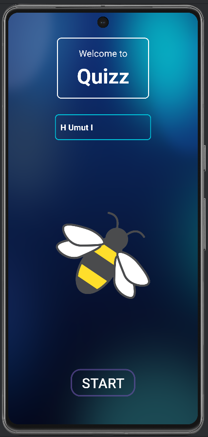
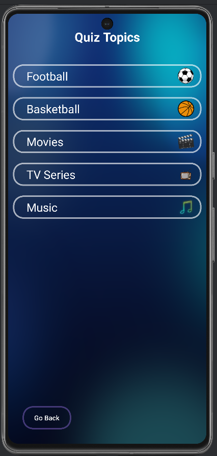
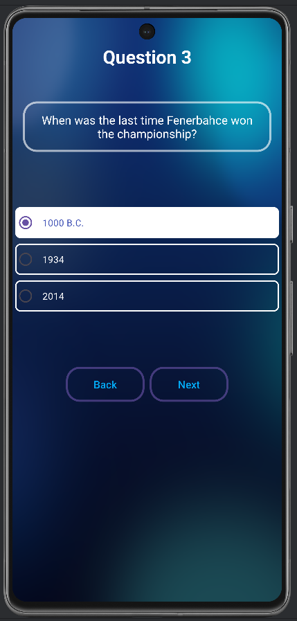
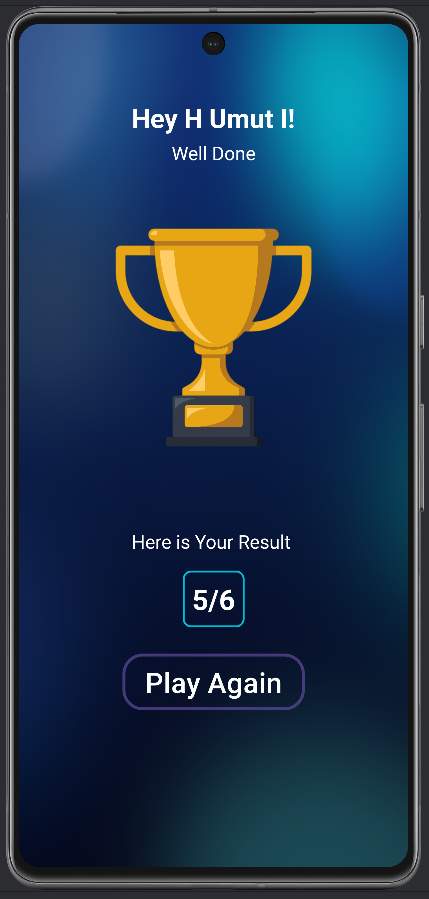

# Quizz (a basic quiz app)
## Project Description 

1) This project is a basic quiz app coded in Kotlin. There are 5 types of quiz topic and each topic has 6 different questions.
2) Topics: Football, Basketball, Movies, TV Series, Music

## App ScreenShots on Pixel 7 PRO

  &nbsp;&nbsp;&nbsp;

  &nbsp;&nbsp;&nbsp;

  &nbsp;&nbsp;&nbsp;

Quizz with Kotlin by Hüseyin Umut Işık
